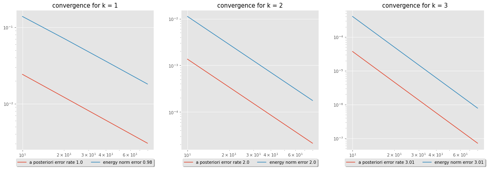
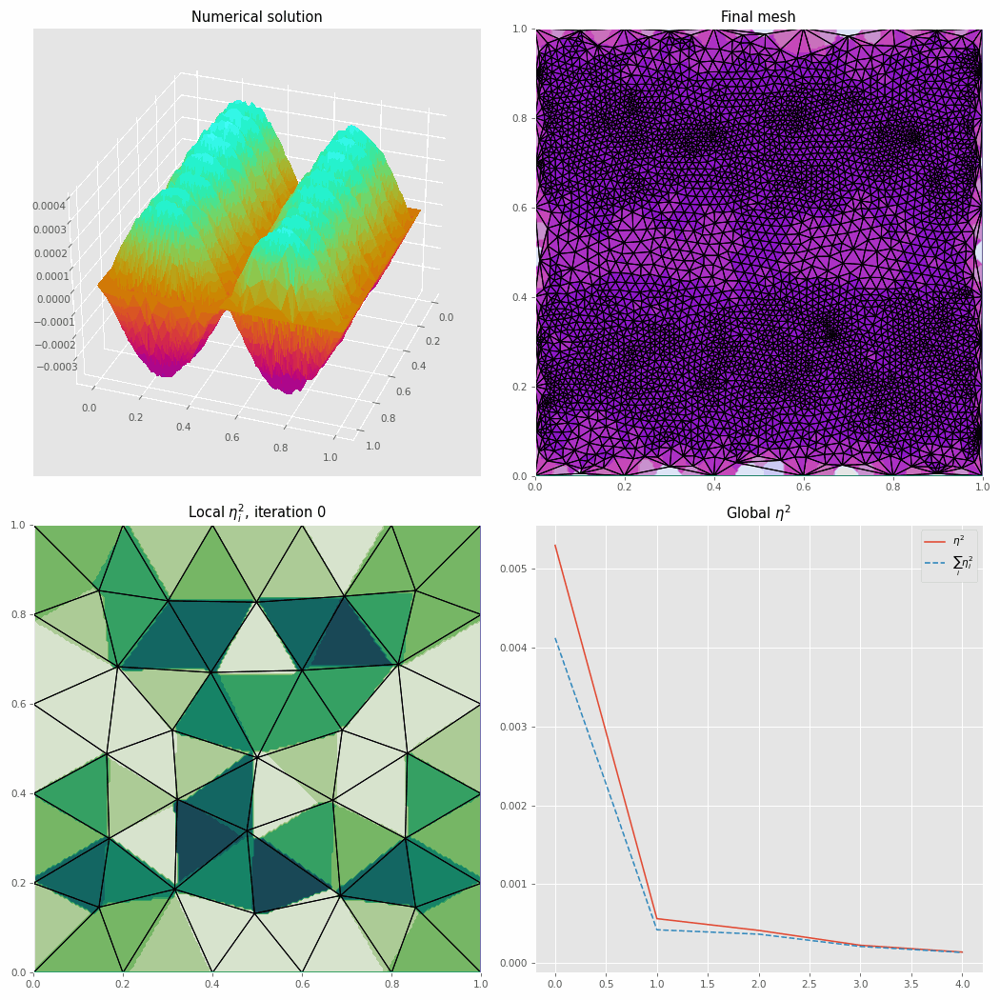
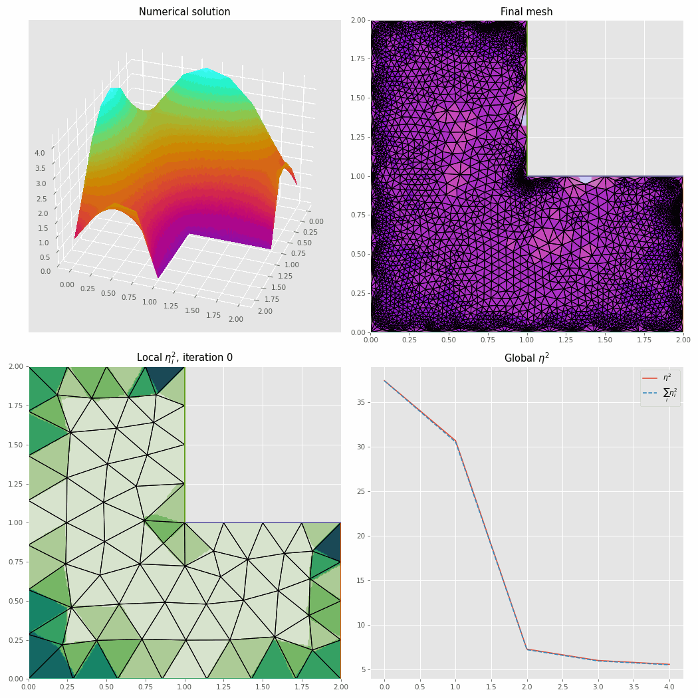

# Adaptive Finite Element Method in Firedrake

Choosing an appropriate grid is crucial in solving problems with finite element methods, aiming for an accurate solution while maintaining computational efficiency.
Our approach seeks a balance by refining the mesh selectively where the error surpasses predefined criteria.

To identify areas for refinement, we employ a residual-based a posteriori estimate, focusing on the Helmholtz equation. 
After establishing an a posteriori upper bound, we validate its sharpness and reliability through numerical verification before incorporating it into mesh refinement.
The solution is computed using the `Firedrake` library, and mesh construction is facilitated by `pygmsh`.

## Overview

The core of this repository consists of a codebase implemented in `Firedrake` for adaptive solving of the Helmholtz equation. We derive an a posteriori estimate and utilize it for mesh refinement.
A numerical experiment is conducted to demonstrate the sharpness and reliability of the a posteriori estimate.

## Results

### Sharp and Reliable Experiment

The error in the energy norm and the error in the a posteriori norm have the same order, implying that the estimate is sharp and reliable.

### Solutions of Helmholtz Equation

### Solution of Helmholtz on L-shaped Domain

